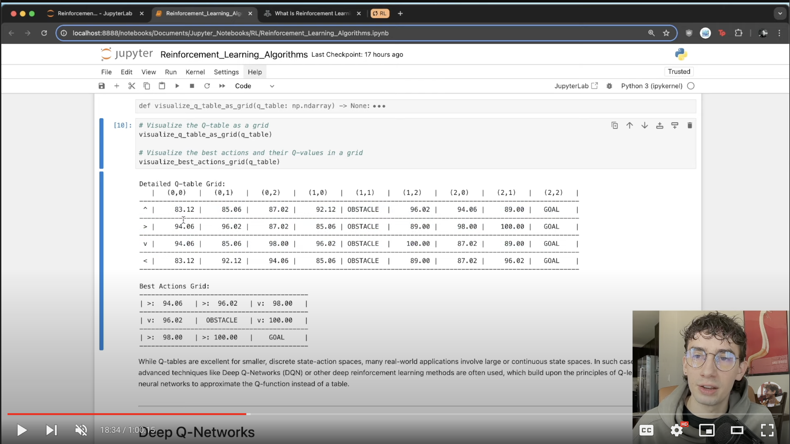
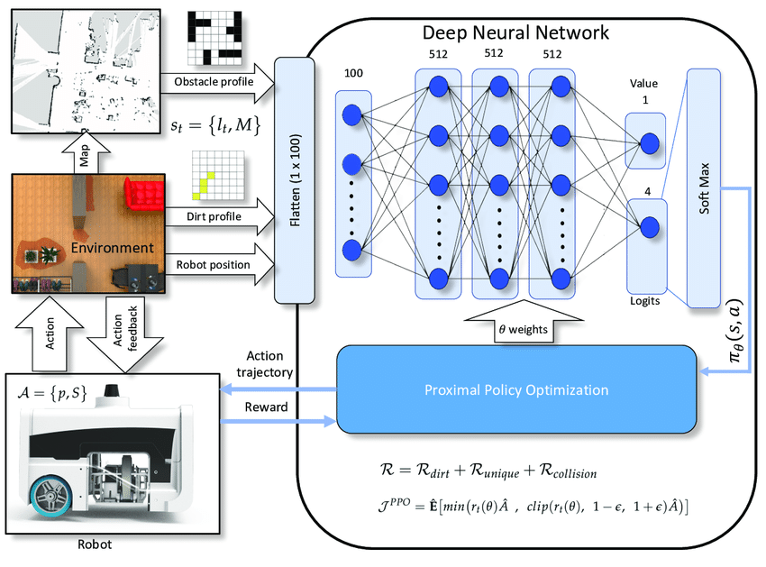

# 3 Reinforcement Learning Algorithms Everybody Should Know!

## Check out my Video Walkthrough here

Click play to watch :)

Reinforcement learning is a type of machine learning where an *agent* learns to make decisions by interacting with an environment. The main components of reinforcement learning are:

1. **Agent**: The entity that learns and makes decisions.
2. **Environment**: The world in which the agent operates.
3. **State**: The current situation of the agent in the environment.
4. **Action**: A decision made by the agent.
5. **Reward**: Positive or negative feedback from the environment based on the agent's action.
6. **Policy**: The strategy the agent uses to determine its actions.

The goal of reinforcement learning is for the agent to learn an optimal policy that maximizes cumulative rewards over time. This is achieved through a process of trial and error, where the agent explores the environment, takes actions, and learns from the consequences (rewards) of those actions.

## In This Notebook we'll cover 3 Major Algorithms and Implementations Including...

### Q-Learning

### Deep Q-Network (DQN)

### Proximal Policy Optimization (PPO)

